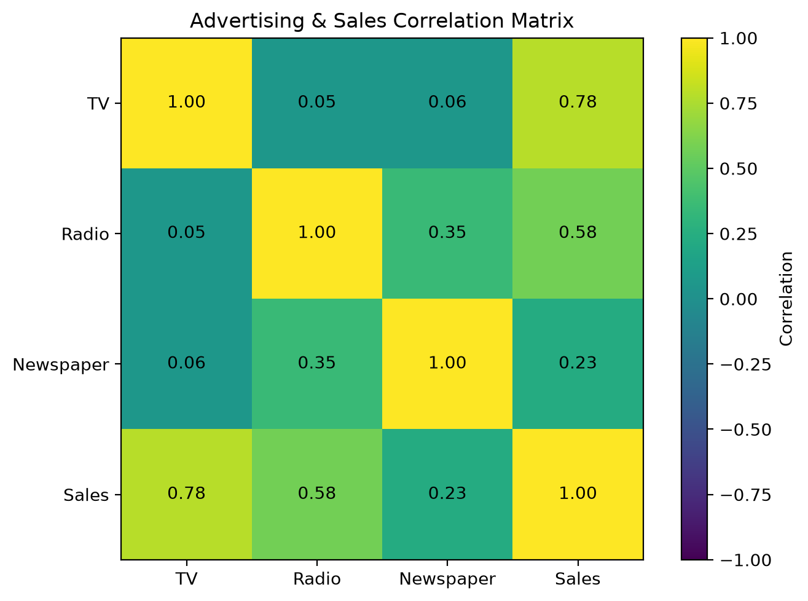
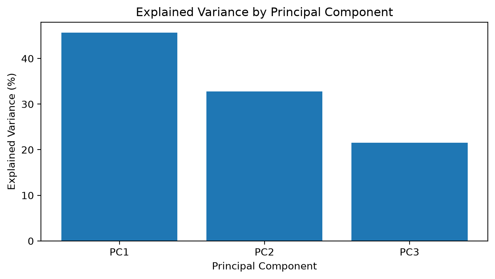
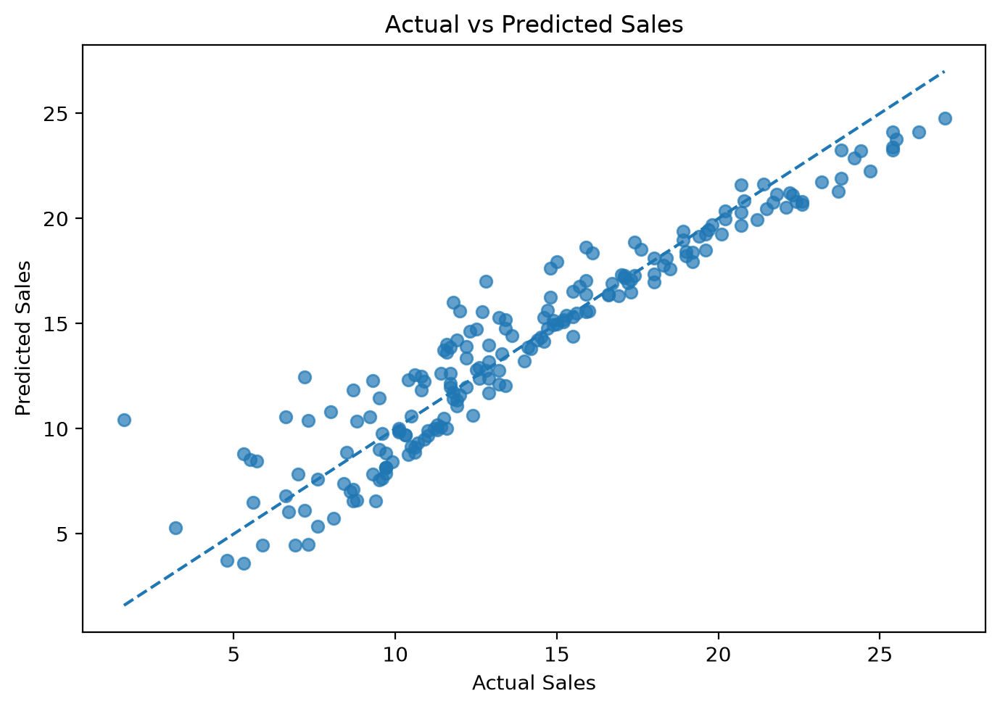
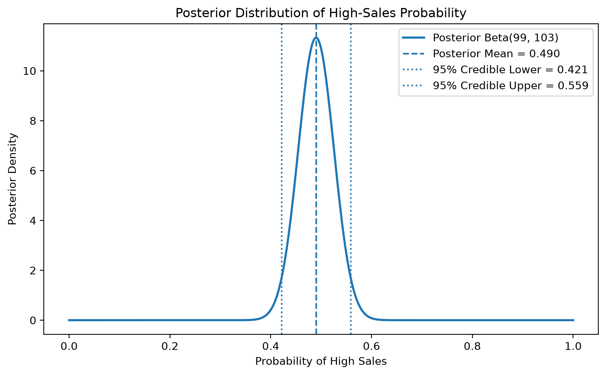

# Advertising & Sales Statistical Analysis

A statistical analysis of advertising expenditure and sales using exploratory data analysis, linear algebra, Singular Value Decomposition (SVD), multiple linear regression, statistical inference, and Bayesian estimation.

This project examines how advertising expenditure across **TV, Radio, and Newspaper** channels is associated with product **Sales**, while demonstrating several core statistical and mathematical techniques used in data analysis.

## Project Overview

The analysis combines four complementary perspectives:

- **Exploratory Data Analysis (EDA)** to understand distributions, data quality, outliers, and relationships between variables.
- **Matrix Analysis & SVD** to examine the multivariate structure of the advertising channels and reduce dimensionality.
- **Multiple Linear Regression** to estimate the association between advertising expenditure and Sales while controlling for the other channels.
- **Bayesian Analysis** to estimate the probability of observing a high-sales outcome and quantify uncertainty.

The full analysis, calculations, visualizations, and interpretations are available in the [Jupyter Notebook](notebook/advertising-sales-statistical-analysis.ipynb).

---

## Dataset

The project uses the classic **Advertising** dataset from *An Introduction to Statistical Learning (ISL)*.

It contains **200 observations** and four analytical variables:

| Variable | Description |
| --- | --- |
| `TV` | Advertising expenditure on television |
| `Radio` | Advertising expenditure on radio |
| `Newspaper` | Advertising expenditure on newspapers |
| `Sales` | Observed product sales |

The original CSV also contains a row-index column, which is removed before analysis.

The dataset itself is **not redistributed in this repository**. Download and setup instructions are available in [`data/README.md`](data/README.md).

---

## Analysis Workflow

### 1. Exploratory Data Analysis

The dataset was checked for data-quality issues and examined using descriptive statistics, histograms, boxplots, scatterplots, and correlation analysis.

Key observations:

- No missing values or duplicate rows were identified.
- `TV` has the strongest simple correlation with Sales (`r ≈ 0.78`).
- `Radio` has a moderate positive correlation with Sales (`r ≈ 0.58`).
- `Newspaper` has a substantially weaker relationship with Sales (`r ≈ 0.23`).
- `Newspaper` is the most positively skewed advertising variable.

---

### 2. Matrix Analysis & Dimensionality Reduction

The advertising variables were standardized before applying covariance analysis, eigenvalue decomposition, and Singular Value Decomposition.

The first three components explain:

| Component | Explained Variance |
| --- | ---: |
| PC1 | 45.70% |
| PC2 | 32.78% |
| PC3 | 21.53% |

The first two components retain approximately **78.47%** of the total variance.

Component loadings show that:

- **PC1** is driven primarily by `Radio` and `Newspaper`.
- **PC2** is dominated by `TV`.
- **PC3** mainly contrasts `Radio` and `Newspaper`.

---

### 3. Multiple Linear Regression

The following model was estimated using an **SVD-based pseudo-inverse** rather than a high-level regression estimator:

`Sales = β₀ + β₁(TV) + β₂(Radio) + β₃(Newspaper) + ε`

Regression results:

| Predictor | Coefficient | p-value | Standardized Coefficient |
| --- | ---: | ---: | ---: |
| TV | 0.0458 | 1.510e-81 | 0.753 |
| Radio | 0.1885 | 1.505e-54 | 0.537 |
| Newspaper | -0.0010 | 0.860 | -0.004 |

Model performance:

| Metric | Value |
| --- | ---: |
| R² | 0.8972 |
| Adjusted R² | 0.8956 |
| RMSE | 1.6686 |
| MAE | 1.2520 |

Both **TV** and **Radio** are statistically significant after controlling for the other advertising channels, while **Newspaper is not statistically significant**.

Because the predictors use different numerical scales, standardized coefficients provide a more meaningful comparison of relative association. On this basis, **TV shows the strongest association with Sales**, followed by Radio.

---

### 4. Bayesian Analysis

A high-sales observation was defined as:

`Sales > median(Sales)`

with a median Sales threshold of **12.9**.

Using a uniform `Beta(1, 1)` prior:

- High-sales observations: **98 / 200**
- Observed high-sales rate: **49.0%**
- Posterior distribution: **Beta(99, 103)**
- Posterior mean: **0.4901**
- 95% credible interval: **[0.4215, 0.5589]**

The posterior therefore estimates the probability of a high-sales observation at approximately **49.0%**, while explicitly representing uncertainty around that estimate.

---

## Key Takeaways

The analysis provides several consistent findings:

- `TV` and `Radio` are the advertising channels most strongly associated with Sales.
- `TV` has the strongest standardized association in the multiple regression model.
- `Newspaper` provides little additional predictive information after controlling for TV and Radio.
- The regression model explains approximately **89.7% of the observed variation in Sales**.
- Two SVD components preserve approximately **78.5%** of the variability in advertising expenditure.
- Bayesian estimation provides both a probability estimate and an explicit measure of uncertainty for high-sales outcomes.

These results describe **statistical associations in the observed dataset and should not be interpreted as causal advertising effects**.

---

## Repository Structure

    advertising-sales-statistical-analysis/
    ├── assets/
    │   ├── actual-vs-predicted-sales.png
    │   ├── advertising-sales-correlations.png
    │   ├── bayesian-posterior.png
    │   └── svd-explained-variance.png
    ├── data/
    │   └── README.md
    ├── notebook/
    │   └── advertising-sales-statistical-analysis.ipynb
    ├── .gitignore
    └── README.md

---

## Reproducing the Analysis

1. Download the Advertising dataset as described in [`data/README.md`](data/README.md).
2. Save the dataset as:

       data/Advertising.csv

3. Install the required Python packages:

       pip install pandas numpy matplotlib scipy

4. Open:

       notebook/advertising-sales-statistical-analysis.ipynb

5. Restart the kernel and run all cells.

The notebook automatically locates the dataset from the repository structure and regenerates the README visual assets.

---

## Tools & Techniques

**Python** · **Pandas** · **NumPy** · **Matplotlib** · **SciPy** · **Descriptive Statistics** · **Linear Algebra** · **SVD** · **Multiple Linear Regression** · **Statistical Inference** · **Bayesian Analysis**

---

## Course Context

Developed as part of the **Statistics & Mathematics for Data Analysts** coursework at **MCI Academy**.

---

## Author

**Mohammad Habibi**